| Supported Targets | ESP32 |
| ----------------- | ----- |

Link GitHub: https://github.com/BungVuQuang/wsn_sensor
# Giới thiệu chung
Dự án này được viết nhằm mục đích tạo ra 1 Node cảm biến đo nhiệt độ DS18B20 sử dụng công nghệ truyền thông BLE để truyền tin, sử dụng pin làm nguồn nuôi

  ---

# Yêu cầu hệ thống

1. Phiên bản ESP-IDF từ 3.5 trở lên

---
# Cài đặt tính năng trong Menuconfig
Bật các tính năng như trong hình trong menuconfig
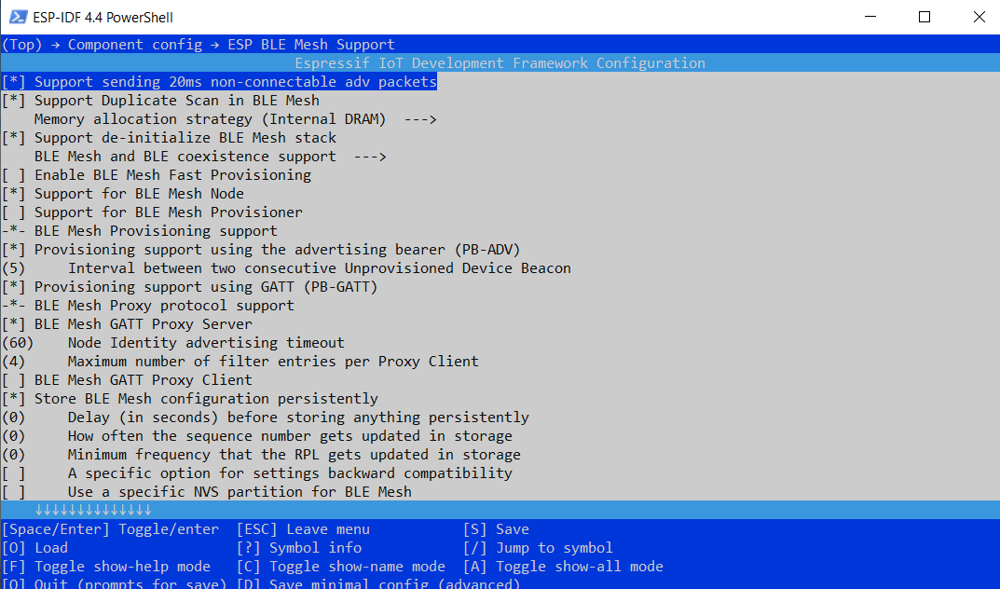

Cấp phát 0x7000 byte cho vùng SPIFFS để sử dụng lưu trữ data Backup
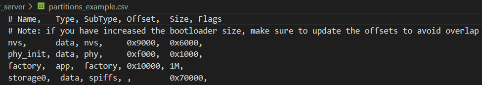

---
# Hướng dẫn sử dụng code

#### Khởi tạo GPIO, ADC, NVS_FLASH
- Khởi tạo GPIO cho các led báo ngưỡng nhiệt độ
- Khởi tạo ADC 12 bit để đọc điện áp từ Battery
- Khởi tạo ngắt ngoài cho nút bấm thực hiện Show dữ liệu backup lên serial monitor
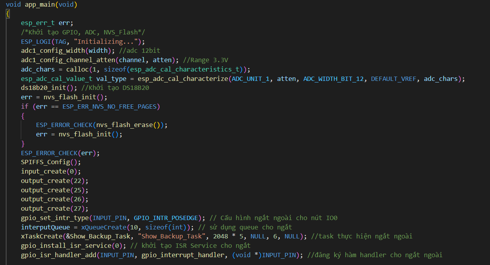

---

#### Khởi tạo Bluetooth Controller, Bluetooth Mesh

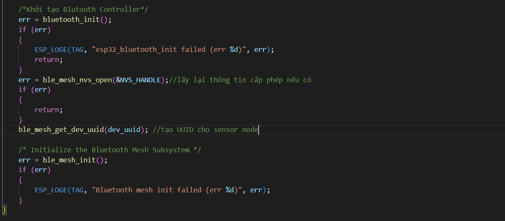

---

#### Đăng ký các hàm Callback xử lý Event nhận được.
- Khi có các Event liên quan đến Provisioning, Config Server,Sensor Server thì nó sẽ gọi lại các hàm được truyền vào tham số.
- Bắt đầu phát các gói tin quảng cáo

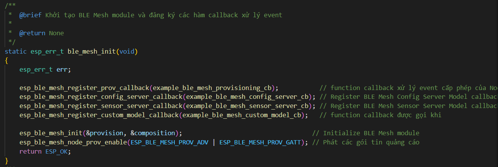

---

#### Xử lý tin nhắn nhận được từ gateway
- Hàm này được gọi lại khi có sự kiện tin nhắn gửi đến từ gateway và send tin nhắn đến gateway

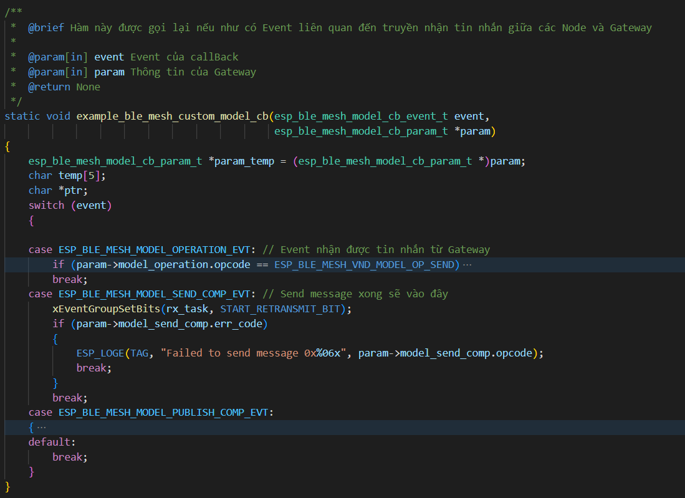

---

#### Lưu lại thông tin về Sensor Model để giao tiếp từ Node đến Gateway
- Hàm này được gọi lại khi gateway gửi thông tin về Sensor Model cho Node

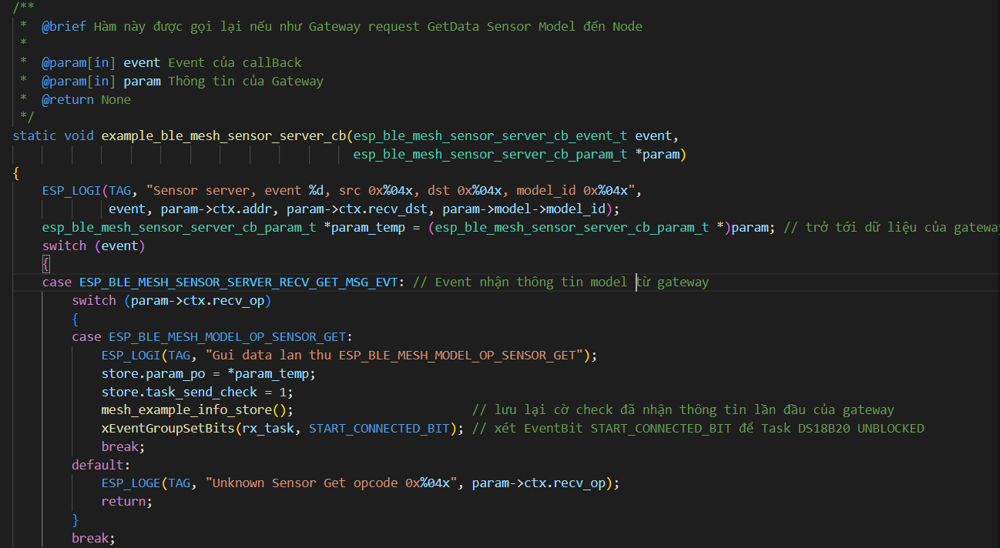

---

#### Tạo các Task thực hiện đọc dữ liệu nhiệt độ và Battery
- Khi việc cung cấp 1 node vào mạng thành công thì bắt đầu đo nhiệt độ và Battery
- Tạo EventGroup để đồng bộ các Task

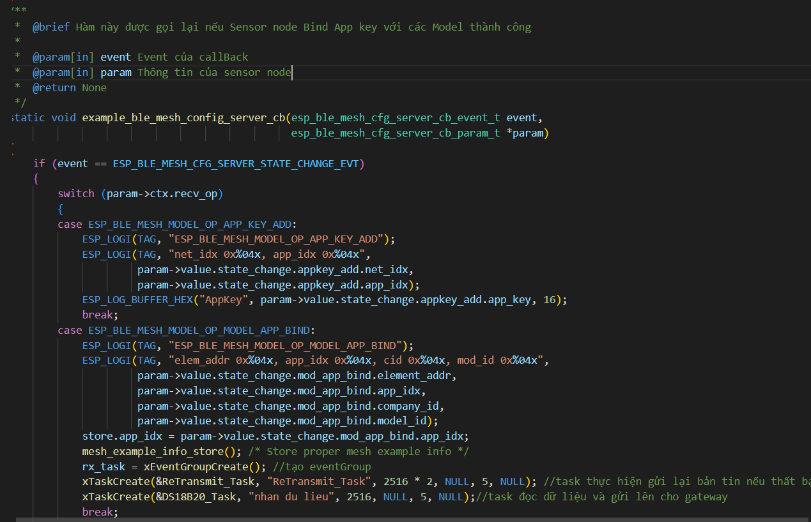

---

#### Khôi phục lại thông tin Node khi khởi động
- Qúa trình cung cấp 1 node vào mạng sẽ gọi đến hàm này
- Thông tin gồm App key, Network Key và các trạng thái sẽ được khôi phục lại.
- Tạo Task đo nhiệt độ và Battery 

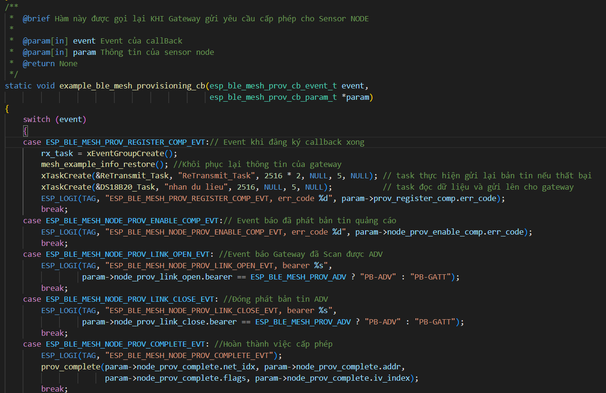

---

##### Task đọc dữ liệu nhiệt độ và Battery
- Sử dụng EventGroup để hướng sự kiện 1 node được cung cấp vào mạng
- Thực hiện đọc dữ liệu DS18B20 như theo Datasheet
- ADC sẽ được đọc 64 lần và chia trung bình.Sử dụng 2 điện trở để phân áp trước khi vào ADC.Bật led báo sắp pin khi dưới 20%
- Gửi tin nhắn đến gateway gồm nhiệt độ và mức pin(%)
- Lưu trữ dữ liệu vào SPIFFS khi không nhận được ACK từ gateway. 

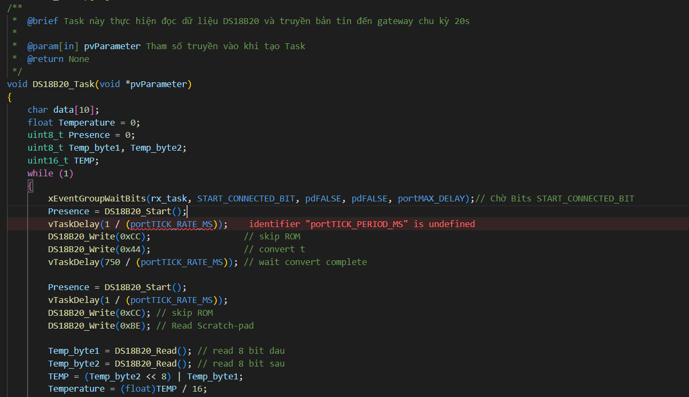
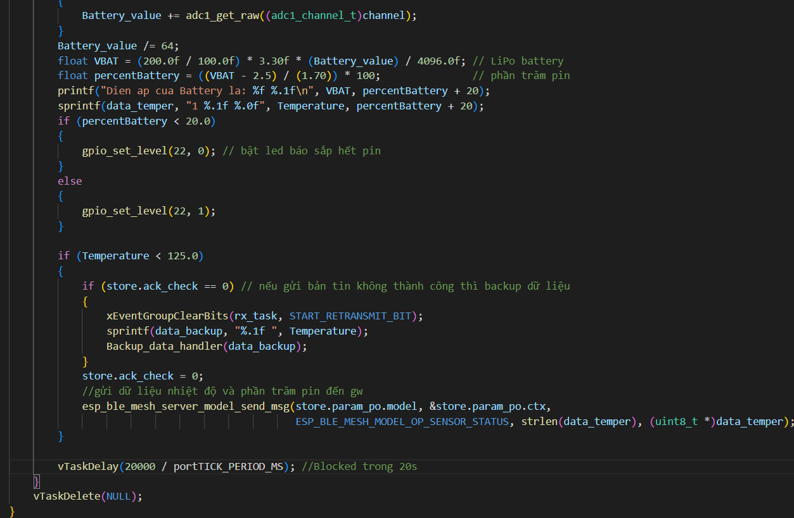
---

#### Gửi lại tin nhắn tối đa 3 lần
- Nếu không nhận được ACK sau khi gửi thì node sẽ gửi lại tối đa 3 lần.

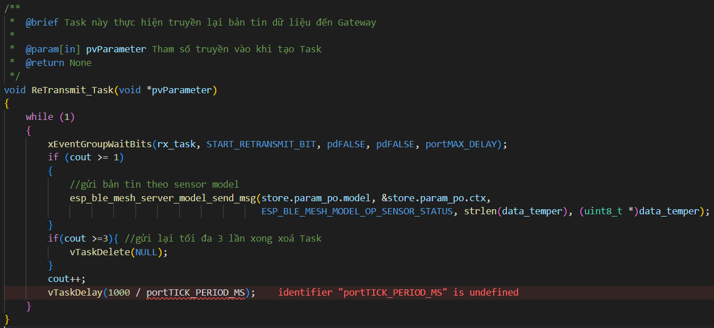

---

#### Tạo file trong SPIFFS để lưu dữ liệu BackUp 

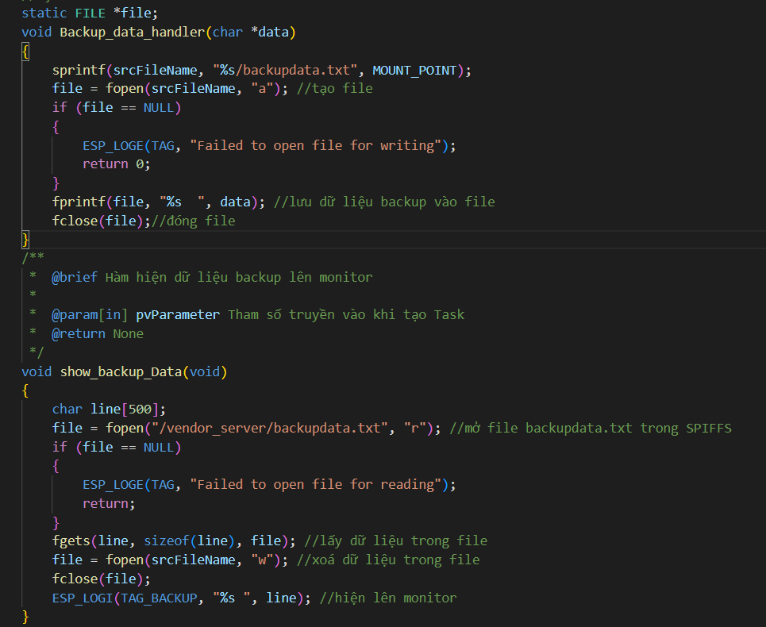

---
#### Khôi phục thông tin của Node trong Mesh

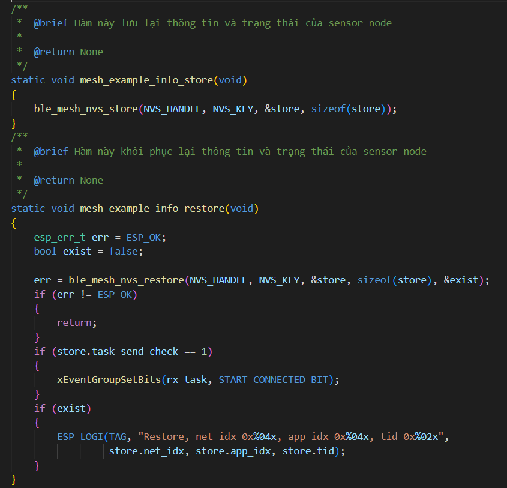
